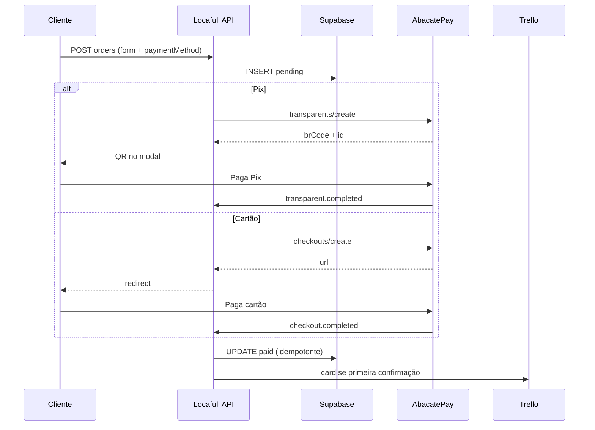

# Locafull — Checkout AbacatePay (Pix + cartão)

**Data:** 2026-05-28  
**Status:** Aprovado  
**Escopo:** Substituir Stripe por AbacatePay no checkout online — **Pix** (checkout transparente, QR no modal) e **cartão** (checkout hospedado, redirect). Manter preços dinâmicos do site, Supabase, Trello e páginas success/cancel.

**Substitui:** `docs/superpowers/specs/2026-05-19-stripe-pix-checkout-design.md` (Stripe removida após migração).

---

## 1. Objetivo

Permitir pagamento online no modal de `/pricing` com:

- **Pix:** QR Code e copia e cola **sem sair** do site (API transparente).
- **Cartão:** redirect para página segura da Abacate (checkout hospedado).

Após confirmação (webhook), persistir pedido no Supabase e criar card no Trello (lista “A agendar”, label “Entregar”) — mesmo comportamento pós-pagamento de hoje.

---

## 2. Decisões de produto

| Tema                      | Decisão                                                                      |
| ------------------------- | ---------------------------------------------------------------------------- |
| Gateway                   | AbacatePay (API v2) — remover Stripe por completo                            |
| Pix                       | Checkout transparente (`POST /v2/transparents/create`)                       |
| Cartão                    | Checkout hospedado (`POST /v2/checkouts/create`, `methods: ["CARD"]`)        |
| Preço Pix                 | Calculado no servidor (`findPricingPlanPrice`) — sem catálogo Abacate        |
| Preço cartão              | Produto cadastrado na Abacate por plano (`abacateProductId` no mapa do site) |
| Pedido antes do pagamento | `status: pending` no Supabase; webhook marca `paid`                          |
| Idempotência              | `payment_id` único; webhooks duplicados não duplicam Trello                  |
| WhatsApp / dinheiro       | Fora deste spec (fluxo humano inalterado)                                    |

### Taxas (referência comercial Abacate — não bloqueia implementação)

| Método | Custo aproximado    | Disponibilidade do valor                       |
| ------ | ------------------- | ---------------------------------------------- |
| Pix    | R$ 0,80 / transação | Na hora                                        |
| Cartão | 3,5% + R$ 0,60      | ~32 dias (antecipação opcional com taxa extra) |

Copy no UI pode mencionar Pix “na hora” sem detalhar taxa; cartão sem prometer crédito imediato à Locafull.

---

## 3. Fluxo

```
/pricing?product=&plan= → modal → formulário de entrega
  → escolha: Pix | Cartão
  → POST /api/abacatepay/orders (cria pending + cobrança)

Pix:
  → resposta: brCode, brCodeBase64, chargeId, expiresAt
  → UI: QR + copiar + aguardando pagamento
  → webhook transparent.completed → paid → Trello
  → cliente: /checkout/success?orderId=...

Cartão:
  → resposta: url (checkout Abacate)
  → redirect window.location
  → cliente paga na Abacate
  → webhook checkout.completed → paid → Trello
  → completionUrl → /checkout/success?orderId=...
```



---

## 4. Abordagens consideradas

| Abordagem                          | Prós                                   | Contras                             | Veredito           |
| ---------------------------------- | -------------------------------------- | ----------------------------------- | ------------------ |
| **A — Híbrido (escolhida)**        | Pix no modal; cartão na página Abacate | Dois endpoints + dois webhooks      | ✅                 |
| B — Só checkout hospedado Pix+Card | Menos código front                     | Cliente sai do site para Pix também | ❌ pior UX         |
| C — Só Pix transparente            | Simples                                | Sem cartão online                   | ❌ usuário pediu B |

---

## 5. Remoção Stripe

### Código e dependências

| Remover                                                  | Notas                     |
| -------------------------------------------------------- | ------------------------- |
| `stripe` (package.json)                                  | —                         |
| `src/lib/stripe.ts`                                      | —                         |
| `src/lib/stripe-payment-methods.ts`                      | —                         |
| `src/app/api/stripe/checkout/route.ts`                   | —                         |
| `src/app/api/stripe/webhook/route.ts`                    | —                         |
| Tipos `Stripe.*` em `orders/utils.ts`, `insert-order.ts` | Substituir parser Abacate |

### Variáveis de ambiente (Vercel + `.env.example`)

Remover:

- `STRIPE_SECRET_KEY`
- `NEXT_PUBLIC_STRIPE_PUBLISHABLE_KEY`
- `STRIPE_WEBHOOK_SECRET`
- `STRIPE_PAYMENT_METHODS`

### Infra externa

- Desativar webhook no Dashboard Stripe após go-live Abacate.
- Remover `stripe listen` do fluxo local de dev.

### Documentação

- Atualizar `README.md`, `docs/deploy-producao.md`, spec do modal (referências a Stripe).
- Manter spec `2026-05-19-stripe-pix-checkout-design.md` com nota “substituído por 2026-05-28”.

---

## 6. AbacatePay — integração

### Autenticação

- Header: `Authorization: Bearer {ABACATEPAY_API_KEY}`
- Base URL: `https://api.abacatepay.com/v2`
- Ambiente dev/prod definido pela chave (não por host).

Docs: [Autenticação](https://docs.abacatepay.com/pages/authentication), [Webhooks](https://docs.abacatepay.com/pages/webhooks).

### Pix — transparente

```
POST /v2/transparents/create
{
  "method": "PIX",
  "data": {
    "amount": <centavos>,
    "description": "<lineItemName>",
    "expiresIn": 3600,
    "externalId": "<orderId uuid>",
    "customer": { "name", "email", "cellphone" },
    "metadata": { "orderId": "<uuid>" }
  }
}
```

Resposta usada: `data.id`, `data.brCode`, `data.brCodeBase64`, `data.expiresAt`, `data.status`.

Webhook: `transparent.completed` — [payload](https://docs.abacatepay.com/pages/webhooks/events/transparent.md).

Dev: `POST` simular pagamento (doc `transparents/simulate-payment`).

### Cartão — checkout hospedado

```
POST /v2/checkouts/create
{
  "items": [{ "id": "<abacateProductId>", "quantity": 1 }],
  "methods": ["CARD"],
  "externalId": "<orderId uuid>",
  "completionUrl": "<SITE_URL>/checkout/success?orderId=<uuid>",
  "returnUrl": "<SITE_URL>/pricing?product=...&plan=...",
  "metadata": { "orderId": "<uuid>" }
}
```

Resposta: `data.url` → redirect do browser.

Webhook: `checkout.completed` — [payload checkout](https://docs.abacatepay.com/pages/webhooks/events/checkout.md).

### Webhook único no Locafull

Rota: `POST /api/abacatepay/webhook?webhookSecret=...`

1. Validar `webhookSecret` (query) === `ABACATEPAY_WEBHOOK_SECRET`.
2. Validar header `X-Webhook-Signature` (HMAC-SHA256, chave pública da doc Abacate).
3. Se `event` ∈ `{ transparent.completed, checkout.completed }` → confirmar pedido.
4. Responder `200` somente após persistência bem-sucedida (Abacate reenvia em falha).

Ignorar na v1: `*.refunded`, `*.disputed`, assinaturas, saques.

---

## 7. Banco de dados (Supabase)

### Migration

Renomear / evoluir tabela `orders`:

| Antes                        | Depois                                                   |
| ---------------------------- | -------------------------------------------------------- |
| `stripe_session_id` (unique) | `payment_id` (text, unique, nullable até criar cobrança) |
| `status` só `paid`           | `pending` \| `paid` \| `expired` \| `cancelled`          |
| —                            | `payment_provider` text default `'abacatepay'`           |
| —                            | `payment_method` text nullable (`pix` \| `card`)         |

Pedidos históricos Stripe: opcional migration `payment_provider = 'stripe'` nos registros existentes (coluna antiga renomeada ou cópia).

### Linha `pending` (criação)

Preencher todos os campos do formulário + `amount_cents` + `product_id` + `plan_id` + `payment_method` escolhido.

### Linha `paid` (webhook)

Atualizar `status`, `payment_id` (id Abacate), `paid_at` (opcional, `now()`).

---

## 8. Catálogo Abacate (cartão)

Para cada plano com `orderEnabled: true` em `pricing/constants`, adicionar:

```ts
abacateProductId: "prod_xxxxxxxx";
```

**Setup manual (pré-deploy):**

1. Criar produtos na dashboard Abacate com preço alinhado ao site.
2. Copiar IDs para o constants/map.
3. Ao alterar preço no site → atualizar produto na Abacate (dashboard ou API).

Se `abacateProductId` ausente para plano cartão → API retorna 400 com mensagem clara.

Pix **não** exige produto na Abacate.

---

## 9. API Next.js

| Rota                                      | Método | Função                                                                       |
| ----------------------------------------- | ------ | ---------------------------------------------------------------------------- |
| `/api/abacatepay/orders`                  | POST   | Valida form; insert pending; cria cobrança; retorna pix payload ou `{ url }` |
| `/api/abacatepay/webhook`                 | POST   | Confirma pagamento                                                           |
| `/api/abacatepay/orders/[orderId]/status` | GET    | Opcional v1: `{ status }` para polling no modal Pix                          |

### `lib/abacatepay/`

- `client.ts` — `fetch` com Bearer, tratamento de erro padronizado
- `create-pix-charge.ts`
- `create-card-checkout.ts`
- `verify-webhook.ts` — secret + HMAC
- `types.ts` — payloads mínimos (sem validar schema inteiro no webhook)

### `lib/orders/`

- `insert-pending-order.ts`
- `confirm-order-from-webhook.ts` (substitui fluxo Stripe)
- `build-order-from-webhook.ts` — lê `externalId` / `metadata.orderId`
- Atualizar `insert-order.ts` → chamar Trello só quando transição pending→paid

---

## 10. UI — modal de checkout

### Novo passo: forma de pagamento

Após validação do formulário (ou integrado ao submit):

- Radio/cards: **Pix** | **Cartão de crédito**
- Submit dispara `POST /api/abacatepay/orders` com `paymentMethod: "pix" | "card"`

### Tela Pix (`OrderPixPayment/` ou subpasta em `OrderCheckoutModal`)

- Imagem `brCodeBase64`
- Input read-only + botão “Copiar código Pix”
- Texto: valor, expiração (`expiresAt`)
- Estado “Aguardando confirmação…”
- Polling opcional em `GET .../status` a cada 3–5s (máx. até expirar)
- Ao `paid`: `router.push` success com `orderId`

### Tela Cartão

- Loading → `window.location.href = url`
- `returnUrl` volta ao pricing com query do produto

### Copy botões

- Pix: “Pagar com Pix”
- Cartão: “Pagar com cartão” (substitui “Pagar com cartão” Stripe)

### Páginas result

- `/checkout/success?orderId=` — mensagem genérica (não depender de `session_id` Stripe)
- `/checkout/cancel` — inalterada conceitualmente

---

## 11. Variáveis de ambiente

```env
# AbacatePay
ABACATEPAY_API_KEY=
ABACATEPAY_WEBHOOK_SECRET=

# Opcional: sobrescrever chave HMAC pública (default: constante da doc Abacate)
# ABACATEPAY_WEBHOOK_HMAC_KEY=
```

Remover todas as `STRIPE_*`.

Webhook local: tunnel (ngrok/cloudflare) ou CLI Abacate se disponível — documentar em `docs/deploy-producao.md`.

---

## 12. Trello

Inalterado em regra de negócio: após `paid`, `createTrelloCardForOrder`.

Ajustes:

- Descrição do card: `Pedido AbacatePay: {payment_id}` (não “Stripe”).
- Incluir `payment_method` (Pix/Cartão) na descrição se útil para equipe.

---

## 13. Erros e edge cases

| Situação                              | Comportamento                                                                                                                               |
| ------------------------------------- | ------------------------------------------------------------------------------------------------------------------------------------------- |
| Valor adulterado no client            | Servidor recalcula `amount_cents`                                                                                                           |
| Webhook duplicado                     | `payment_id` unique → skip insert; Trello só na 1ª confirmação                                                                              |
| Pix expirado (`EXPIRED`)              | UI: “Gerar novo Pix” → novo `transparents/create` (novo `payment_id`, mesmo ou novo `orderId` — preferir novo pending se expirado há muito) |
| Cartão abandonado                     | `pending` permanece; sem Trello                                                                                                             |
| Abacate 401/5xx                       | Mensagem amigável; log `[abacatepay]`                                                                                                       |
| Plano sem `abacateProductId` + cartão | 400 antes de chamar Abacate                                                                                                                 |
| Conta em devMode                      | Fluxo igual; simular Pix via API dev                                                                                                        |

---

## 14. Testes

| Tipo        | O que cobrir                                                   |
| ----------- | -------------------------------------------------------------- |
| Unit        | `build-order-from-webhook`, `verify-webhook`, validação amount |
| Unit        | Mapeamento `transparent.completed` e `checkout.completed`      |
| Integration | Webhook route com payload fixture + mock Supabase              |
| Manual      | Dev: Pix simulate → webhook → Trello                           |
| Manual      | Dev/prod: cartão teste Abacate → success URL                   |
| Regressão   | Modal abre/fecha; query `product`/`plan`; `pnpm test`          |

---

## 15. Deploy / checklist

- [ ] Conta AbacatePay verificada (produção)
- [ ] Chaves API dev e prod na Vercel
- [ ] Produtos Abacate criados + IDs no código
- [ ] Webhook prod: `https://locafull.vercel.app/api/abacatepay/webhook?webhookSecret=...`
- [ ] Migration Supabase aplicada
- [ ] Teste Pix + cartão em staging/prod
- [ ] Remover env e webhook Stripe
- [ ] Atualizar docs WhatsApp IA (mencionar Pix/cartão no site quando ativo)

---

## 16. Fora do escopo (v1)

- Boleto Abacate
- Cupons / assinaturas Abacate
- Reembolso automático via API
- Sync automático de preço produto Abacate ↔ constants
- Painel admin de pedidos
- CPF/CNPJ obrigatório no formulário (avaliar se Abacate exigir no cartão em testes)
- Remover pedidos `pending` órfãos (cron)

---

## 17. Referências

- [Criar cobrança PIX (transparente)](https://docs.abacatepay.com/pages/transparents/create)
- [Criar Checkout (hospedado)](https://docs.abacatepay.com/pages/payment/create)
- [Webhooks](https://docs.abacatepay.com/pages/webhooks)
- [Evento transparent.completed](https://docs.abacatepay.com/pages/webhooks/events/transparent.md)
- Spec modal: `docs/superpowers/specs/2026-05-21-order-checkout-modal-design.md`
